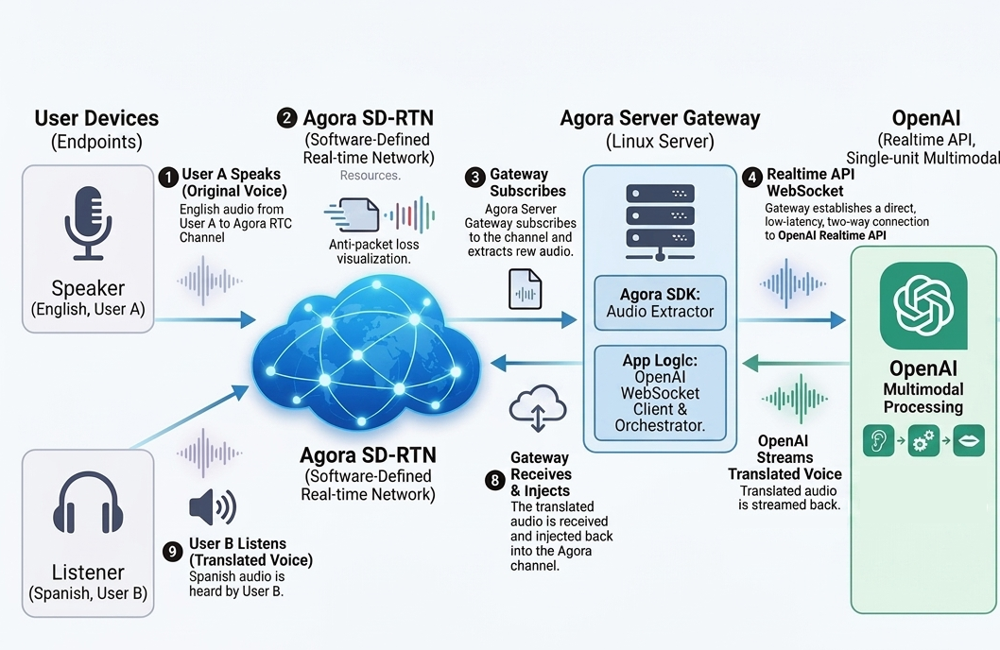

# Agora RealTime Translator Bot

Real-time audio translation PoC: joins an Agora RTC channel, subscribes to a speaker's audio, translates it via OpenAI Realtime API, and republishes translated audio under a bot UID. Listeners subscribe to that UID. Transcripts (source + translated) are emitted as JSON on an Agora data stream.



> **⚠️ Proof of concept — not for production use.**
> This project is a functional demo. Several design shortcuts make it unsuitable for production without significant rework. See [Limitations](#limitations) below.

## Pick your deploy path

| | Platform | What you need |
|---|---|---|
| [](https://render.com/deploy?repo=https://github.com/Bac1314/Agora-server-gateway-openai-translate) | **Render** (amd64) | Render account, Agora App ID, OpenAI key |
| [](https://console.aws.amazon.com/cloudformation/home#/stacks/create/template) | **AWS Fargate** (ECS) — download [`deploy/aws/translator-bot.cfn.yaml`](deploy/aws/translator-bot.cfn.yaml) and upload when prompted | AWS account, Agora App ID, OpenAI key |
| `docker run -e API_KEY=... -e ...` | **Local Docker** | Docker Desktop, Agora App ID, OpenAI key |

> **Prerequisite for all paths:** Disable token authentication in the [Agora Console](https://console.agora.io) for your project.
> Settings → Project Management → (your project) → Security → Primary certificate → toggle **OFF**.

---

## Quick start — end-to-end

### 1. Run the server

```bash
docker run --rm \
  -e API_KEY=my-secret-key \
  -p 8080:8080 \
  ghcr.io/bac1314/agora-server-gateway-openai-translate:latest
```

Or build from source (arm64):

```bash
docker build --platform linux/arm64 -t translator-bot-server .
docker run --rm -e API_KEY=my-secret-key -p 8080:8080 translator-bot-server
```

### 2. Start a translation session

```bash
curl -s -X POST http://localhost:8080/sessions \
  -H "X-Api-Key: my-secret-key" \
  -H "Content-Type: application/json" \
  -d '{
    "agoraAppId": "<your-agora-app-id>",
    "openAiKey":  "sk-...",
    "channel":    "translate-test",
    "srcLang":    "en",
    "dstLang":    "es"
  }'
```

Response (`201 Created`):

```json
{
  "sessionId": "a3f1c8d2e5b09471",
  "botUid":    2000,
  "channel":   "translate-test",
  "srcLang":   "en",
  "dstLang":   "es",
  "startedAt": "2024-01-15T10:30:00Z",
  "status":    "running",
  "exitCode":  null
}
```

Save `sessionId` and `botUid` — you need both.

### 3. Client: join the channel and subscribe to the bot

Use the Agora Web SDK (4.x) in your app. Subscribe to the `botUid` returned above to receive translated audio.

```js
import AgoraRTC from "agora-rtc-sdk-ng";

const client = AgoraRTC.createClient({ mode: "live", codec: "vp8" });
await client.setClientRole("audience");
await client.join("<agoraAppId>", "translate-test", null, localUid);

client.on("user-published", async (user, mediaType) => {
  if (user.uid === botUid && mediaType === "audio") {
    await client.subscribe(user, "audio");
    user.audioTrack.play();  // play translated audio
  }
});
```

The speaker (whoever's audio gets translated) must join as `"host"` in the same channel. `speakerUid: 0` in the session request means the bot subscribes to the first host it sees.

### 4. Client: receive transcript captions

The bot sends JSON on an Agora data stream. Listen for it alongside audio:

```js
client.on("stream-message", (uid, data) => {
  if (uid !== botUid) return;
  const msg = JSON.parse(new TextDecoder().decode(data));
  // msg = { lang, text, isFinal, ts }

  if (msg.lang === "en") {
    // source transcript (speaker's words)
    showCaption("source", msg.text, msg.isFinal);
  } else {
    // translated transcript
    showCaption("translated", msg.text, msg.isFinal);
  }
});
```

`isFinal: false` = partial utterance (stream as the user speaks).
`isFinal: true` = utterance complete.

### 5. Stop the session

```bash
curl -s -X DELETE http://localhost:8080/sessions/<sessionId> \
  -H "X-Api-Key: my-secret-key"
```

Returns `204 No Content`.

### 6. Smoke-test with Agora Web Demo

To test the audio path without writing client code, open [webdemo.agora.io](https://webdemo.agora.io) in two tabs:

- **Tab 1 (speaker):** join `translate-test`, host role, speak.
- **Tab 2 (listener):** join `translate-test`, audience role, subscribe to `botUid`.

---

## REST API reference

All endpoints require the header:

```
X-Api-Key: <API_KEY>
```

Missing or wrong key returns `401 {"error":"invalid or missing API key"}`.

### Route table

| Method | Path | Description |
|---|---|---|
| `POST` | `/sessions` | Start a translation bot |
| `GET` | `/sessions` | List running sessions |
| `GET` | `/sessions/:id` | Get session status |
| `DELETE` | `/sessions/:id` | Stop bot (SIGTERM) |
| `GET` | `/health` | Liveness + active session count |

---

### POST /sessions

Start a new translator bot process.

**Request body:**

| Field | Type | Required | Default | Description |
|---|---|---|---|---|
| `agoraAppId` | string | yes | — | Agora project App ID |
| `openAiKey` | string | yes | — | OpenAI API key with Realtime access |
| `channel` | string | yes | — | Agora channel name to join |
| `srcLang` | string | no | `"en"` | ISO language code of the speaker |
| `dstLang` | string | no | `"es"` | ISO language code for translation output |
| `speakerUid` | int | no | `0` | Agora UID to subscribe to (`0` = first host seen) |
| `botUid` | int | no | auto | Bot's UID in the channel. Auto-assigned from pool 2000–2999 if omitted |
| `idleExitSeconds` | int | no | `300` | Seconds of silence before the bot exits |

**Response `201 Created`:** [Session object](#session-object)

**Errors:**

| Status | Condition |
|---|---|
| `400` | Invalid JSON or missing `agoraAppId`, `openAiKey`, or `channel` |
| `409` | A session with the same channel + `botUid` is already running |
| `503` | `MAX_SESSIONS` limit reached, or `botUid` pool 2000–2999 exhausted |

---

### GET /sessions

List all currently running sessions. Exited sessions are not included.

**Response `200 OK`:** array of [Session objects](#session-object)

---

### GET /sessions/:id

Get current state of a session, including exit information once it has stopped.

**Response `200 OK`:** [Session object](#session-object)

**Errors:** `404` if session ID is unknown.

---

### DELETE /sessions/:id

Send SIGTERM to the bot process.

**Response `204 No Content`** on success.

**Errors:** `404` if session is not found or already exited.

---

### GET /health

Liveness check. Does not require auth.

> **Note:** Auth middleware applies to all routes including `/health`. Pass `X-Api-Key` or configure your load balancer to strip/add it.

**Response `200 OK`:**

```json
{ "status": "ok", "sessions": 3 }
```

`sessions` is the count of currently running bot processes.

---

### Session object

Returned by `POST /sessions`, `GET /sessions`, and `GET /sessions/:id`.

```json
{
  "sessionId": "a3f1c8d2e5b09471",
  "botUid":    2000,
  "channel":   "translate-test",
  "srcLang":   "en",
  "dstLang":   "es",
  "startedAt": "2024-01-15T10:30:00Z",
  "status":    "running",
  "exitCode":  null
}
```

| Field | Description |
|---|---|
| `sessionId` | Opaque string ID for this session |
| `botUid` | Agora UID the bot joined with — listeners must subscribe to this UID |
| `channel` | Channel the bot joined |
| `srcLang` | Speaker language (ISO code) |
| `dstLang` | Translation output language (ISO code) |
| `startedAt` | UTC timestamp when the bot process started |
| `status` | `"running"` or `"exited"` |
| `exitCode` | Process exit code when `status` is `"exited"`. `null` for abnormal termination (signal kill, I/O error) |

---

## Transcript data-stream contract

The bot sends captions over an Agora data stream (reliable, ordered). Your client receives them via the `stream-message` event on the same channel — no separate subscription needed.

### Message schema

```json
{
  "lang":    "en",
  "text":    "Hello, how are you today?",
  "isFinal": true,
  "ts":      1705316200123
}
```

| Field | Type | Description |
|---|---|---|
| `lang` | string | ISO code — matches `srcLang` for speaker words, `dstLang` for translation |
| `text` | string | Partial or complete utterance text |
| `isFinal` | bool | `false` while the utterance is in progress; `true` at the utterance boundary |
| `ts` | number | Milliseconds since Unix epoch at send time |

### Stream behavior

- Each utterance produces **two parallel streams**: one in `srcLang` (speaker words), one in `dstLang` (translation).
- Both start with `isFinal: false` deltas and end with a single `isFinal: true` message.
- Max payload: 1 KB per packet (enforced by the bot). Packets exceeding this are dropped.
- Throughput limit: 30 packets/s, 6 KB/s per sender (Agora data stream constraint).

### Receiving in the Web SDK

```js
client.on("stream-message", (uid, data) => {
  if (uid !== botUid) return;
  const msg = JSON.parse(new TextDecoder().decode(data));
  console.log(msg.lang, msg.isFinal, msg.text, new Date(msg.ts));
});
```

---

## Server environment variables

| Var | Default | Description |
|---|---|---|
| `API_KEY` | (required) | Static key for `X-Api-Key` auth |
| `PORT` | `8080` | HTTP listen port |
| `MAX_SESSIONS` | `10` | Hard cap on concurrent bot processes; returns `503` when full |
| `BOT_BINARY` | `/app/agora_rtc_sdk/example/out/translator_bot` | Path to the bot binary |

---

## Architecture

```
Speaker mic
  → Agora RTC channel
  → Bot subscribes (16kHz PCM)
  → Resampler 16k→24k
  → OpenAI Realtime API (gpt-realtime-translate)
  → Translated 24kHz PCM
  → Resampler 24k→16k
  → JitterBuffer
  → Bot publishes as botUid
  → Listeners subscribe to botUid
```

Transcripts (`{lang, text, isFinal, ts}`) are sent in parallel on an Agora data stream. Any client in the same channel receives them via `stream-message`.

---

## Limitations

**1. Agora token authentication must be disabled**

The bot joins channels without a token. To run this project, you must turn off token auth in the Agora Console for your App ID. This means any client that knows your App ID can join any channel in that project — a serious security gap in production. A production system would generate short-lived tokens server-side and pass them to both the bot and client apps.

**2. In-memory session store — no persistence**

Sessions are stored in a Go `map` in process memory (`cmd/server/store.go`). All session state is lost on server restart or crash. There is no database, no session recovery, and no way to query sessions that existed before the current process started.

**3. Single-node only — no horizontal scaling**

Session state is local to one process. Running multiple server instances behind a load balancer will not work: a `GET /sessions/:id` or `DELETE /sessions/:id` routed to a different instance will return `404`. Scaling out requires externalizing session state (e.g. Redis, a database) and bot process management.

**4. Static single API key**

All callers share one `API_KEY` env var. There is no per-client key, no key rotation, and no revocation. A leaked key grants full access to create and stop bots.

**5. OpenAI API key passed in every request**

The caller supplies their OpenAI key in the `POST /sessions` request body. The server holds it in memory for the lifetime of the session. It is never logged, but this pattern is awkward for key rotation and makes the server a higher-value target.

**6. No TLS on the REST server**

The server listens on plain HTTP. Run it behind a TLS-terminating reverse proxy (Render and AWS Fargate do this automatically) — do not expose port 8080 directly to the internet.

**7. Bot UID pool capped at 1000 per server**

Auto-assigned bot UIDs come from the range 2000–2999. Maximum 1000 concurrent bots per server instance before `POST /sessions` returns `503`.

---

## Known issues / open items

1. **Channels per host** — Load test needed; estimate 10–50 per 8-core box.
